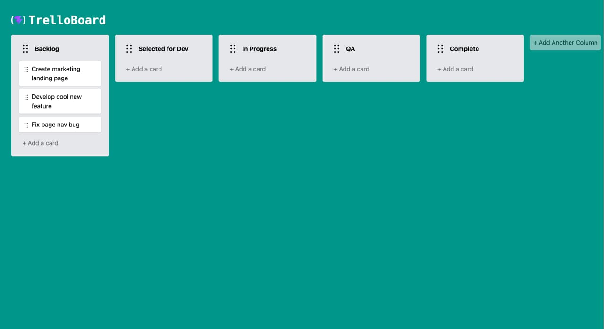

# Vue Trello Board

Канбан-доска в стиле Trello на Vue 3 + TypeScript. Колонки и карточки можно
создавать, редактировать, перетаскивать и удалять. Состояние доски сохраняется
в `localStorage`, так что данные не теряются при перезагрузке страницы.



## Возможности

- **Колонки** — создание («+ Add Another Column»), переименование (inline-input,
  Enter — подтвердить), удаление по Backspace на пустом названии
- **Карточки** — создание через поле ввода (Enter / Tab), удаление по Backspace
  на сфокусированной карточке
- **Drag & drop** — перетаскивание колонок и карточек, перенос карточек между
  колонками; при зажатом **Alt** карточка копируется, а не перемещается
- **Сохранение** — состояние доски персистится в `localStorage`

## Стек

- [Vue 3](https://vuejs.org/) (`<script setup>`) + [TypeScript](https://www.typescriptlang.org/)
- [Vite](https://vite.dev/) — сборка и dev-сервер
- [Tailwind CSS](https://tailwindcss.com/) — стили
- [vuedraggable](https://github.com/SortableJS/vue.draggable.next) — drag & drop
- [@vueuse/core](https://vueuse.org/) — `useLocalStorage`, `useKeyModifier`, `onKeyStroke`
- [nanoid](https://github.com/ai/nanoid) — генерация id

## Установка и запуск

```bash
npm install      # установка зависимостей
npm run dev      # dev-сервер
npm run build    # сборка в dist/
npm run preview  # просмотр собранной версии
```

## Линтинг и форматирование

```bash
npm run lint     # eslint + stylelint + prettier (проверка)
npm run format   # prettier --write
```

ESLint, Stylelint и Prettier также запускаются автоматически на pre-commit
через Husky + lint-staged.

## Структура проекта

```
src/
├── components/
│   ├── TrelloBoard.vue       # доска: колонки, drag & drop, localStorage
│   ├── TrelloBoardTask.vue   # карточка задачи
│   ├── NewTask.vue           # форма добавления карточки
│   └── DragHandle.vue        # ручка для перетаскивания
├── types/                    # типы Task и Column
├── App.vue                   # шапка и контейнер доски
└── main.ts                   # точка входа
```
